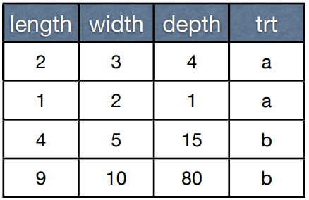
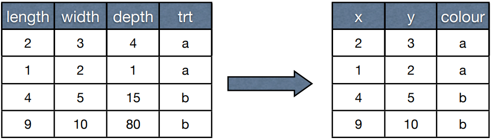
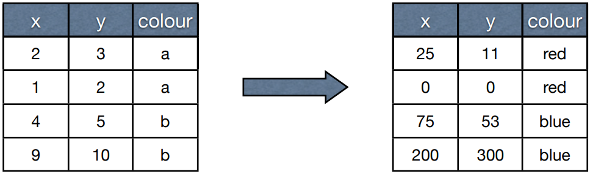
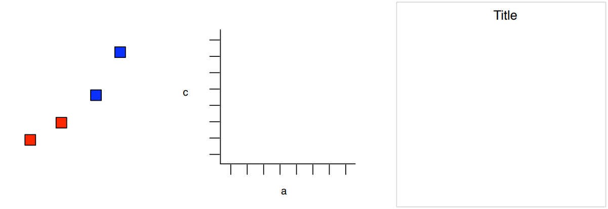
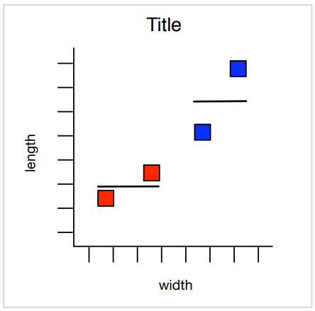

```{r setup, include=FALSE}
options(htmltools.dir.version = FALSE)
```

class: center, middle


---
class: inverse, middle

# Agenda

+ Introducción: instalación, documentación, los datos
+ ¿Cómo hacer una gráfica?
+ Geometrías, estadísticas, escalas, facetas y sistemas de coordenadas
+ `qplot`

---
class: middle

# ggplot2

```{r eval=FALSE}
install.packages("ggplot2")
```

+ [http://had.co.nz/ggplot2](http://had.co.nz/ggplot2)
  + Documentación de alrededor de 90 objectos de `ggplot` con más de 500 ejemplos
+ Datos:
```{r, include=FALSE}
library(ggplot2)
library(dplyr)
```

```{r tidy=FALSE}
str(diamonds)
```
  
---
class: inverse, middle

# Valores predeterminados

+ Capas con funciones de conveniencia
  + Múltiples niveles que permiten un intercambio entre simplicidad y control
  + `qplot` es más simple, pero nos da menos control
+ Para entender niveles más sofisticados necesitamos una comprensión básica de la gramática

---
class: middle

# ¿Cómo hacer una gráfica?

.pull-left[
]

.pull-right[

]

---
class: middle

# ¿Cómo hacer una gráfica?

.pull-left[
+ Queremos hacer una gráfica de dispersión de `length` y `width`
]

.pull-right[

]

---
class: middle

# ¿Cómo hacer una gráfica?

.pull-left[
+ Queremos hacer una gráfica de dispersión de `length` y `width`
+ ¿Qué es una gráfica de dispersión?
]

.pull-right[

]

---
class: middle

# ¿Cómo hacer una gráfica?

.pull-left[
+ Queremos hacer una gráfica de dispersión de `length` y `width`
+ ¿Qué es una gráfica de dispersión?
  + Representa cada observación con un punto (**geom**)
]

.pull-right[

]

---
class: middle

# ¿Cómo hacer una gráfica?

.pull-left[
+ Queremos hacer una gráfica de dispersión de `length` y `width`
+ ¿Qué es una gráfica de dispersión?
  + Representa cada observación con un punto (**geom**)
  + Escala lineal en los ejes *x* y *y* (**scale**)
]

.pull-right[

]

---
class: middle

# ¿Cómo hacer una gráfica?

.pull-left[
+ Queremos hacer una gráfica de dispersión de `length` y `width`
+ ¿Qué es una gráfica de dispersión?
  + Representa cada observación con un punto (**geom**)
  + Escala lineal de los ejes *x* y *y* (**scale**)
  + Sistema de coordenadas cartesiano
]

.pull-right[

]

---
class: center, middle

# Datos


---
class: center, middle

# Mapeo


---
class: center, middle

# Escala
Necesitamos convertir los datos a unidades físicas de "dibujo"



---
class: center, middle

# Capas


---
class: center, middle

# Gráfica


---
class: middle, inverse

# Componentes

+ Datos
+ Objeto geométrico (**geom**)
+ Transformación estadística (**stat**)
+ Escalas (**scale**)
+ Sistema de coordenadas
+ (+ ajuste de posición, facetas)

---
class: middle

# Histograma

.pull-left[
+ **geom**: bar
+ **stat**: bin
+ **scale**: lineal
+ **coordenadas**: cartesiano
]

.pull-right[
```{r, echo=FALSE, fig.height=4, fig.width=6, message=FALSE}
diamonds %>% ggplot(aes(x=price)) + geom_histogram()
```
]

---
class: middle

# Gráfica de Dispersión

.pull-left[
+ **geom**: point
+ **stat**: identity
+ **scale**: lineal
+ **coordenadas**: cartesiano
]

.pull-right[
```{r, echo=FALSE, fig.height=4, fig.width=6, message=FALSE}
diamonds %>% ggplot(aes(x=carat, y=price)) + geom_point()
```
]

---
class: middle, inverse

# Capas

+ La descripción anterior está un poco simplificada. 
+ En realidad, tenemos: valores predeterminados + capas + escalas + sistema de coordenadas
+ Capa = datos + mapeo + geometría + estadística + posición

---
class: middle, inverse

# Definición

```
ggplot(data, mapping) +
layer(
  stat = "",
  geom = "",
  position = "",
  geom_parms = list(),
  stat_params = list(),
)
```
---
class: middle, inverse

# Capas

+ Usualmente no escribimos las especificaciones completas, usamos un atajo:
  + `geom_smooth()`
  + `stat_summary()`
+ Cada `geom` tiene un `stat` predeterminado, cada `stat` tiene un `geom` predeterminado (pero se pueden sobreescribir) 

---
class: middle

# Ejemplo
```{r, fig.align='center', fig.height=5, fig.width=8, message=FALSE, tidy=FALSE}
ggplot(diamonds)
```

---
class: middle

# Ejemplo
```{r, fig.align='center', fig.height=5, fig.width=8, message=FALSE, tidy=FALSE}
ggplot(diamonds) + aes(x=carat, y=price)
```

---
class: middle

# Ejemplo
```{r, fig.align='center', fig.height=5, fig.width=8, message=FALSE, tidy=FALSE}
ggplot(diamonds) + aes(x=carat, y=price) + 
  geom_point()
```

---
class: middle

# Ejemplo
```{r, fig.align='center', fig.height=5, fig.width=8, message=FALSE, tidy=FALSE}
ggplot(diamonds) + aes(x=carat, y=price) + 
  geom_point() + aes(colour=carat)
```

---
class: middle

# Ejemplo

Simplificado:
```{r, fig.align='center', fig.height=4.5, fig.width=8, message=FALSE, tidy=FALSE}
ggplot(diamonds, aes(x=carat, y=price)) + 
  geom_point(aes(colour=carat))
```

Y obtenemos el mismo resultado.

---
class: middle, inverse

# Datos + Mapeo

+ Los datos y el mapeo de estos usualmente permanecen en la misma gráfica por lo que son almacenados como predeterminados:
  + `ggplot(data, mapping = aes(x=x, y=y))`
  + La función `aes` describe relaciones, no aporta datos 

---
class: middle, inverse

# Geometrías

+ Las geometrías definen la forma básica de los elementos de la gráfica.
+ Básicos: `point`, `line`, `polygon`, `bar`
+ Compuestos: `boxplot`, `pointrange`
+ Estadísticos: `histogram`, `smooth`, `density`

---
class: middle, inverse

# Estadísticas

+ No las hemos usado realmente, pero están por detrás de varias de las capas que hemos creado. Algunas geometrías son realmente estadísticas disfrazadas: 
  + `geom_histogram = stat_bin + geom_bar`
  + `geom_smooth = stat_smooth + geom_ribbon`
  + `geom_density = stat_density + geom_ribbon`

---
class: middle

# Variaciones a un Histograma

```{r, fig.align='center', fig.height=5, fig.width=8, message=FALSE, tidy=FALSE}
p <- ggplot(diamonds, aes(x=price))
p + geom_histogram()
```

---
class: middle

# Variaciones a un Histograma

```{r, fig.align='center', fig.height=5, fig.width=8, message=FALSE, tidy=FALSE}
p + stat_bin(geom="area")
```

---
class: middle

# Variaciones a un Histograma

```{r, fig.align='center', fig.height=5, fig.width=8, message=FALSE, tidy=FALSE}
p + geom_histogram(aes(fill = clarity))
```

---
class: middle, inverse

# Nuevas Variables

+ Algunas estadístcas producen nuevas variables en los datos
  + `stat_bin` produce `count` y `density`
+ Si queremos mapear un `aesthetic` a una de estas nuevas variables, basta con que la rodeemos de `..`
  + `+ geom_histogram(aes(y = ..density..))`
  + `+ geom_histogram(aes(colour = ..count..))`

---
class: middle, inverse

# Parámetros

+ Los parámetros modifican la apariencia de las geometrías y las operaciones de las estadísticas:
  + `+ geom_smooth(method=lm)`
  + `+ stat_bin(binwidth = 100)`
  + `+ stat_summary(fun="mean_cl_boot")`
  + `+ geom_boxplot(outlier.colour = "red")`
+ Cualquier `aesthetic` puede ser también usado como parámetro:
  + `+ geom_point(colour = "red", size = 5)`
  + `+ geom_line(linetype = 3)`

---
class: middle, inverse

# Setear vs Mapear

```{r}
p <- ggplot(diamonds, aes(x=carat,y=price))
```

¿Qué hará esto?

1. `p + geom_point(aes(colour = "green"))`
2. `p + geom_point(colour = "green")`

---
class: middle

# Setear vs Mapear (1)

```{r, fig.align='center', fig.height=5, fig.width=8, message=FALSE, tidy=FALSE}
p + geom_point(aes(colour = "green"))
```

---
class: middle

# Setear vs Mapear (2)

```{r, fig.align='center', fig.height=5, fig.width=8, message=FALSE, tidy=FALSE}
p + geom_point(colour = "green")
```

---
class: middle, inverse

# Escalas

+ Las escalas controlan el mapeo entre los datos y los `aesthetics`, también controlan cómo se muestra la guía que los une (ejes o leyendas)
+ `ggplot` automáticamente añade escalas predeterminadas dependiendo de lo que necesitemos, pero casi seguro tendremos que personalizarlas.
+ Básicas: cambia nombres y rangos o límites  
+ De posición: son usadas para graficar en escalas no lineales
+ Las escalas que más comunmente manipulamos son `colour/fill` 
  + discreto: `hue`, `brewer`, `grey`, `manual`
  + continuo: `gradient`, `gradient2`

---
class: middle, inverse

# Facetas

+ Es común que queramos graficar pequeños y múltiples subconjuntos de los datos
+ Para lograr esto, usamos:
  + `+ facet_grid(row ~ col, margins = TRUE)`

---
class: middle

# Ejemplo

```{r, fig.align='center', fig.height=5, fig.width=8, message=FALSE, tidy=FALSE}
ggplot(diamonds, aes(x=carat, y=price)) +
  geom_point() +
  geom_smooth(method=lm) +
  facet_grid(cut ~ .)
```

---
class: middle, inverse

# Sistema de Coordenadas

+ Controla cómo conviven las dos posiciones del `aesthetics` (predeterminado: cartesiano)
  + `coord_flip()`
  + `coord_map()`
  + `coord_polar()`
+ Ocurren después de las estadísticas y afectan la apariencia de las geometrías

---
class: middle

# Ejemplo

```{r, fig.align='center', fig.height=5, fig.width=8, message=FALSE, tidy=FALSE}
ggplot(diamonds, aes(x=carat, y=price)) +
  geom_point() +
  coord_flip()
```

---
class: inverse, middle

# qplot

+ Contiene las características de `ggplot` con una sintaxis similar a la de `plot`
+ Características adicionales:
  + Escala automáticamente los datos
  + Se puede hacer cualquier tipo de gráfica
  + Facetas y márgenes
  + Crea objetos que se pueden guardar y modificar

---
# qplot

```{r, fig.align='center', fig.height=6, fig.width=8, message=FALSE, tidy=FALSE}
qplot(carat, data=diamonds,
geom="histogram", fill=clarity)
```

---
# qplot

```{r, fig.height=5, fig.width=8,  fig.align='center', tidy=FALSE}
qplot(carat, cut, data=diamonds,
geom="jitter", colour=price)
```

---
# qplot

```{r, fig.align='center', fig.height=5, fig.width=8, message=FALSE, tidy=FALSE}
qplot(log10(price), data=diamonds,
geom="histogram", binwidth=0.1)
```

---
# qplot

```{r, fig.align='center', fig.height=5, fig.width=8, message=FALSE, tidy=FALSE}
qplot(price, data=diamonds,
geom="histogram", binwidth=10) +
coord_trans(x="log10")
```

---
class: middle, center 

.pull-left[
# Contacto


[ana@datank.ai](ana@datank.ai)
]

.pull-right[
# Gracias


]